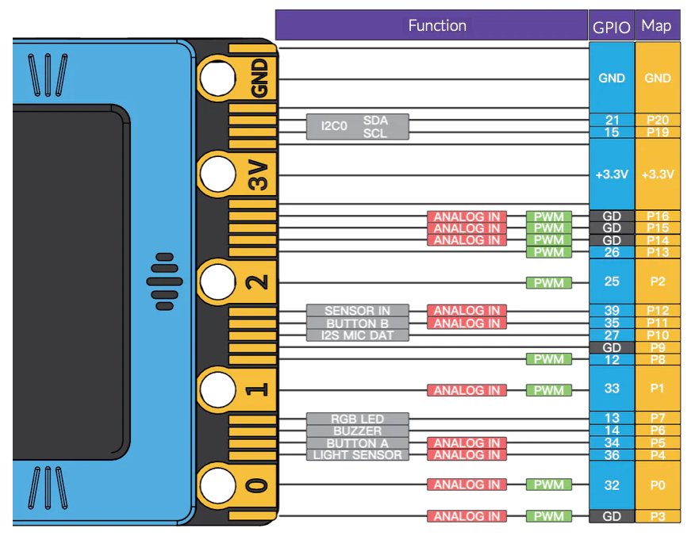

# Adafruit clue nRF52840 Express

Programs and experiments with the Adafruit CLUE NRF52840 Express. It has several sensors directly included, a bright TFT display to give feedback and show data, and a Stemma QT connector for further i2c periferals. Just Wifi is missing. It has

- Nordic nRF52840 Bluetooth LE processor - 1 MB of Flash, 256KB RAM, 64 MHz Cortex M4 processor
- 1.3″ 240×240 Color IPS TFT display for high resolution text and graphics
- Two A / B user buttons and one reset button
- 2 MB internal flash storage for datalogging, images, fonts or CircuitPython code
- Hardware SPI, UART, I2C, and I2S on any pins
- Buzzer/speaker for playing tones and beeps
- Two bright white LEDs in front for illumination / color sensing.
- Qwiic / STEMMA QT connector for adding more sensors, motor controllers, or disp

### Sensors

- ST Micro series 9-DoF motion - LSM6DS33 Accel/Gyro + LIS3MDL magnetometer
- APDS9960 Proximity, Light, Color, and Gesture Sensor
- PDM Microphone sound sensor
- SHT Humidity
- BMP280 temperature and barometric pressure/altitude
- RGB NeoPixel indicator LED

Here is it with some sensors connected and running an i2c_scanner.py:

## Comparison Clue with TFT Gizmo and CircuitPlayground Express

Both have 240x240 pixel displays. And we have one Hallowing M0 with 128x128.

|     Feature     |      Clue     |    CP Express   |   CP Bluefruit  |   Hallowing M0  | T-Display S2 |   rp2040   |
|:---------------:|:-------------:|:---------------:|:---------------:|:---------------:|:------------:|:----------:|
| CPU             |      nRF52840 |       samd21g18 |        nRF52840 |     ATSAMD21G18 |     ESP32-S2 | Cortex M0+ |
| Frequency       |        64 MHz |          48 MHz |          64 MHz |          48 MHz |      240 MHz |    133 MHz |
| RAM             |        256 kB |           32 kB |          256 kB |           32 kB |      8195 kB |     264 kB |
| Display         |       240x240 |         240x240 |         240x240 |         128x128 |      240x135 |     128x64 |
| Accelerometer   | 9DoF LSM6DS33 |          LIS3DH |          LIS3DH |          3-axis |            - |          - |
| Magnetometer    |       LIS3MDL |               - |               - |               - |            - |          - |
| Light sensor    |      APDS9960 | phototransistor | phototransistor | phototransistor |            - |          - |
| Microphone      |           PDM |            MEMS |            MEMS |               - |            - |          - |
| Humidity        |           SHT |               - |               - |               - |            - |          - |
| Temp/Barometer  |        BMP280 |      thermistor |      thermistor |               - |     internal |   internal |
| Speaker         |        Buzzer |          Buzzer |          Buzzer |             ext |            - |          - |
| IR send/receive |             - |          38 kHz |               - |               - |            - |          - |
| I2C             |         Quiic |               - |               - |           Grove |            - |          - |

## Kittenbot

We got some replica boards of the Kittenbot adapter [locally at thegioic.com ](https://www.thegioiic.com/robotbit-module-cho-microbit) called Robot:Bit V3.0.

The challenge for programming is to find good documentation. The board offers 4 Neopixels, driver for 4 DC motors, several servo outputs

- 4 Neopixels on P7 [source](https://www.kittenbot.cc/blogs/learn/future-board-micropython-programming-06-neopixel)
- Servo driver PCA9685 over i2c [source](https://www.kittenbot.cc/products/robotbit-robotics-expansion-board-for-micro-bit)
- 2 DC/Stepper driver DRV8833
- Buzzer P6
- Light sensor P4
- I2C SDA P20, SCL P19

